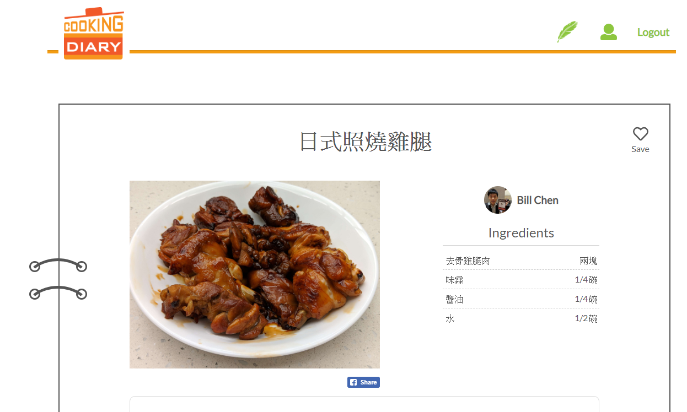

# recipe-angular-laravel

[Demo Website](https://cooking-diary.com/)

## Description

A self-learning recipe website that allows users to upload and share recipes with each other.

## Motivation

The motaivation of this project was to build a mid level scale project that combines all my knowledges from Linux system, Database, Backend Server, and Frontend Technology. And at the same time to provide a place where I can keep notes of all my cooking recipes. (As I really like to cook, and keeping my recipes in Word documents doesn't seem ideal any more.)

## Tech Stacks

| Field               | Technology using                       |
| :------------------ | :------------------------------------- |
| Remote Server       | Digital Ocean Droplet                  |
| Cloud Storage       | Digital Ocean Space                    |
| Server Machine      | Ubuntu 18.04.1                         |
| Database            | Postgres                               |
| Frontend Technology | Angular 6 + SSR managed with pm2       |
| Backend Technology  | Laravel 5.6 with PHP 7.1.3             |

---

## Website Features

* Upload Recipes
* Store recipes in a recipe book collection
* Infinite scroll on home page
* Https Support
* Social
    * Login with Facebook account
    * Share recipes on Facebook
    * Follow other users

---

### Home Page
---

### Recipe Detail Page
---

### User Profile Page
---

### Recipe Book Collection
---

### Upload Recipe
---

